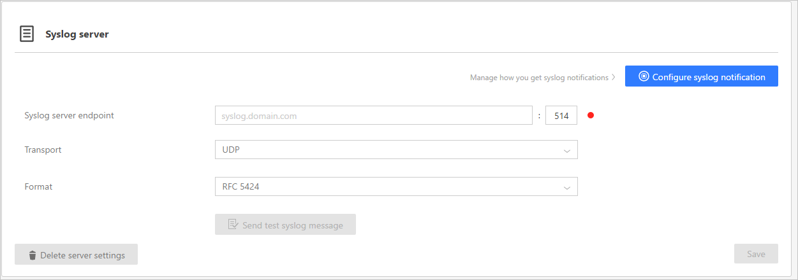

*Gilt für: Advanced Threat Analytics Version 1.7*

# Bereitstellen der Einstellungen Ihres E-Mail-Servers für ATA
ATA kann Benachrichtigungen senden, wenn eine verdächtige Aktivität erkannt wird. Damit ATA E-Mail-Benachrichtigungen senden kann, müssen Sie zunächst die **E-Mail-Servereinstellungen** konfigurieren.

1.  Klicken Sie auf dem ATA Center-Server auf das Symbol **Microsoft Advanced Threat Analytics Management** auf dem Desktop.

2.  Geben Sie Ihren Benutzernamen und Ihr Kennwort ein, und klicken Sie auf **Anmelden**.

3.  Wählen Sie auf der Symbolleiste die Einstellungsoption und dann **Konfiguration** aus.

    

4.  Geben Sie im Bereich **Benachrichtigungen** unter **Mailserver** die folgenden Informationen ein:

    |Feld|Beschreibung|Wert|
    |---------|---------------|---------|
    |SMTP-Server-Endpunkt (erforderlich)|Geben Sie den vollqualifizierten Domänennamen des SMTP-Servers ein, und ändern Sie optional die Portnummer (standardmäßig 25).|Beispiel: smtp.contoso.com|
    |SSL|Schalten Sie auf SSL-Betrieb um, falls der SMTP-Server SSL erfordert. **Hinweis:** Wenn Sie SSL aktivieren, müssen Sie auch die Portnummer ändern.|Der Standardwert ist „deaktiviert“|
    |Authentifizierung|Aktivieren Sie diese Option, falls der Proxyserver eine Authentifizierung erfordert. **Hinweis:** Wenn Authentifizierung aktiviert ist, müssen ein Benutzername und ein Kennwort für ein E-Mail-Konto eingegeben werden, das für den Aufbau einer Verbindung mit dem SMTP-Server berechtigt ist.|Der Standardwert ist „deaktiviert“|
    |Senden von (erforderlich)|Geben Sie die E-Mail-Adresse ein, die als Absender der E-Mail eingetragen wird.|Beispiel: ATA@contoso.com|
    

## Bereitstellen der Einstellungen Ihres Syslog-Servers für ATA
ATA kann Sie durch Senden der Benachrichtigung an den Syslog-Server benachrichtigen, wenn verdächtige Aktivität erkannt wird. Wenn Syslog-Benachrichtigungen aktiviert werden, lassen sich dafür folgende Einstellungen vornehmen.

1.  Vor dem Konfigurieren von Syslog-Benachrichtigungen sollten Sie gemeinsam mit dem zuständigen SIEM-Administrator folgende Angaben ermitteln:

    -   FQDN oder IP-Adresse des SIEM-Servers

    -   Port, der vom SIEM-Server abgehört wird

    -   Transportprotokoll: UDP, TCP oder TLS (geschütztes Syslog)

    -   Versandformat der Daten: RFC 3164 oder 5424

2.  Klicken Sie auf dem ATA Center-Server auf das Symbol **Microsoft Advanced Threat Analytics Management** auf dem Desktop.

3.  Geben Sie Ihren Benutzernamen und Ihr Kennwort ein, und klicken Sie auf **Anmelden**.

4.  Wählen Sie auf der Symbolleiste die Einstellungsoption und dann **Konfiguration** aus.

    

5.  Wählen Sie im Bereich „Benachrichtigungen“ **Syslog-Server** aus, und geben Sie die folgende Informationen ein:

    |Feld|Beschreibung|
    |---------|---------------|
    |Syslog-Server-Endpunkt|Geben Sie den vollqualifizierten Domänennamen des Syslog-Servers ein, und ändern Sie optional die Portnummer (standardmäßig 514).|
    |Transport|Kann UDP, TCP oder TLS (sicheres Syslog) sein|
    |Format|Dies ist das von ATA verwendete Format für das Senden der Ereignisse an den SIEM-Server: RFC 5424 oder RFC 3164.|

 

## Siehe auch
[Weitere Informationen finden Sie im ATA-Forum.](https://social.technet.microsoft.com/Forums/security/home?forum=mata)

<!--HONumber=Feb17_HO1-->

