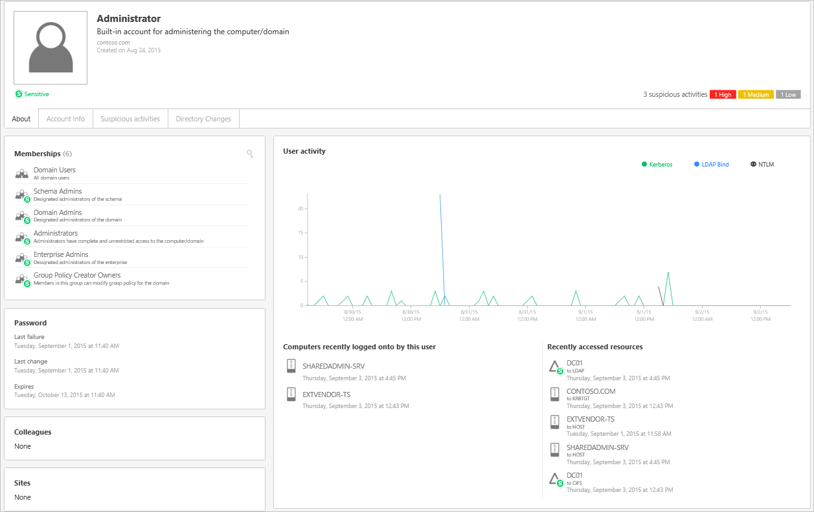

# Arbeiten mit der ATA-Konsole

Verwenden Sie die ATA-Konsole, um die von ATA erkannten verdächtigen Aktivitäten zu überwachen und darauf zu reagieren.

## Aktivieren des Zugriffs auf die ATA-Konsole
Jeder Benutzer, der Mitglied der lokalen Administratorgruppe auf dem ATA Center-Server ist, verfügt über die Berechtigung, sich bei der ATA-Konsole anzumelden und ATA-Einstellungen zu verwalten.
Um einem Benutzer die Anmeldung bei der ATA-Konsole zu ermöglichen, ohne ihn zu einem lokalen Administrator zu machen, fügen Sie ihn zur lokalen Gruppe der **Microsoft Advanced Threat Analytics-Administratoren** hinzu.

## Anmelden bei der ATA-Konsole

1. Klicken Sie auf dem Desktop des ATA Center-Servers auf das Symbol für die **Microsoft ATA-Konsole**, oder öffnen Sie einen Browser, und navigieren Sie zur ATA-Konsole.

    

>[!NOTE]
> Sie können auch entweder in ATA Center oder auf dem ATA-Gateway einen Browser öffnen und zu der IP-Adresse navigieren, die Sie während der ATA Center-Installation für die ATA-Konsole konfiguriert haben.    

2.  Geben Sie Ihren Benutzernamen und Ihr Kennwort ein, und klicken Sie auf **Anmelden**.

> [!NOTE]
> Sie müssen sich mit einem Benutzer anmelden, der Mitglied der lokalen Administratorgruppe ODER der Gruppe der Microsoft Advanced Threat Analytics-Administratoren ist.

## Die ATA-Konsole

Die ATA-Konsole stellt Ihnen einen schnellen Überblick über alle verdächtigen Aktivitäten in zeitlicher Reihenfolge zur Verfügung. Sie ermöglicht es Ihnen, sich die Details einer Aktivität anzusehen und Aktionen entsprechend der jeweiligen Aktivität auszuführen. Die Konsole zeigt außerdem Warnungen und Benachrichtigungen an, um Probleme mit dem ATA-Netzwerk oder neue Aktivitäten hervorzuheben, die als verdächtig eingestuft werden.

Dies sind die wichtigsten Elemente der ATA-Konsole.

### Angriffszeitachse

Dies ist die Standardzielseite, auf die Sie gelangen, wenn Sie sich bei der ATA-Konsole anmelden. Standardmäßig werden alle offenen verdächtigen Aktivitäten auf der Angriffszeitachse angezeigt. Sie können die Angriffszeitachse filtern, um alle verdächtigen Aktivitäten bzw. offene, verworfene oder aufgelöste verdächtige Aktivitäten anzuzeigen. Außerdem wird der Schweregrad angezeigt, der den einzelnen Aktivitäten zugewiesen wurde.

Weitere Informationen finden Sie unter [Arbeiten mit verdächtigen Aktivitäten](/advanced-threat-analytics/deploy-use/working-with-suspicious-activities).

### Benachrichtigungsleiste

Wenn eine neue verdächtige Aktivität erkannt wurde, wird auf der rechten Seite automatisch die Benachrichtigungsleiste geöffnet. Wenn seit Ihrer letzten Anmeldung neue verdächtige Aktivitäten erkannt wurden, wird die Benachrichtigungsleiste geöffnet, nachdem Sie sich erfolgreich angemeldet haben. Sie können jederzeit auf den Pfeil auf der rechten Seite klicken, um auf die Benachrichtigungsleiste zuzugreifen.

### Filterbereich

Sie können basierend auf Status und Schweregrad filtern, welche verdächtigen Aktivitäten auf der Angriffszeitachse oder auf der Registerkarte für verdächtige Aktivitäten des Entitätsprofils angezeigt werden.

### Suchleiste

Im obersten Menü finden Sie eine Suchleiste. Sie können nach einem bestimmten Benutzer, einem Computer oder Gruppen in ATA suchen. Beginnen Sie als Versuch einfach mit der Eingabe.

### Integritätscenter

Das Integritätscenter warnt Sie, wenn in Ihrer ATA-Bereitstellung etwas nicht ordnungsgemäß funktioniert.

Jedes Mal, wenn auf Ihrem System ein Problem auftritt, z. B. ein Verbindungsfehler oder ein getrenntes ATA-Gateway, können Sie dies am Symbol für das Integritätscenter erkennen, auf dem ein roter Punkt angezeigt wird. 

Warnungen des Integritätscenters können verworfen oder aufgelöst werden, und sie sind in Abhängigkeit von ihrem Schweregrad als „Hoch“, „Mittel“ oder „Niedrig“ kategorisiert. Wenn Sie eine Warnung auflösen, die vom ATA-Dienst als noch aktiv erkannt wird, wird sie automatisch in die Liste der offenen Warnungen verschoben. Wenn das System erkennt, dass für eine Warnung keine Ursache mehr vorliegt (die Situation wurde behoben), wird sie automatisch in die Liste der aufgelösten Warnungen verschoben.

### Benutzer- und Computerprofil

ATA erstellt ein Profil für jeden Benutzer und Computer im Netzwerk. Im Benutzerprofil zeigt ATA allgemeine Informationen an, z. B. die Gruppenmitgliedschaft, kürzliche Anmeldungen und Ressourcen, auf die kürzlich zugegriffen wurde.

Im Computerprofil zeigt ATA allgemeine Informationen an, z. B. kürzliche Anmeldungen und Ressourcen, auf die kürzlich zugegriffen wurde.

ATA stellt auf folgenden Seiten zusätzliche Informationen zu Entitäten (Computer, Geräte, Benutzer) bereit: „Zusammenfassung“, „Aktivitäten“ und „Verdächtige Aktivitäten“.

Ein Profil, das ATA nicht vollständig auflösen konnte, wird durch das Symbol eines halb gefüllten Kreises gekennzeichnet.

### Miniprofil

An jeder Stelle in der Konsole, an der eine einzelne Entität angezeigt wird, z. B. ein Benutzer oder ein Computer, wird automatisch ein Miniprofil geöffnet, wenn Sie mit der Maus auf die Entität zeigen. Das Miniprofil enthält die folgenden Informationen (sofern verfügbar):

-   Name

-   Bild

-   E-Mail

-   Telefon

-   Anzahl der verdächtigen Aktivitäten nach Schweregrad

## Weitere Informationen
[Weitere Informationen finden Sie im ATA-Forum.](https://social.technet.microsoft.com/Forums/security/home?forum=mata)

<!--HONumber=Jul16_HO3-->

