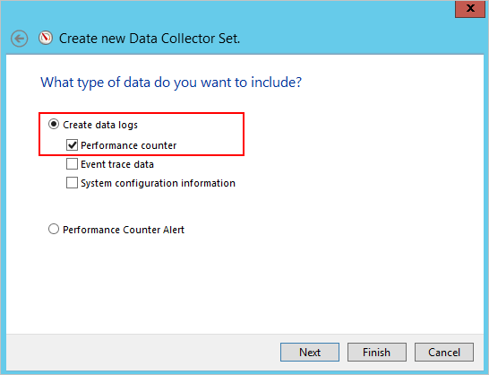

---
# required metadata

title: ATA-Kapazitätsplanung | Microsoft Advanced Threat Analytics
description: Hilft bei der Ermittlung der für Ihr Netzwerk erforderlichen Anzahl der ATA-Server
keywords:
author: rkarlin
manager: stevenpo
ms.date: 04/28/2016
ms.topic: get-started-article
ms.prod: identity-ata
ms.service: advanced-threat-analytics
ms.technology: security
ms.assetid: 279d79f2-962c-4c6f-9702-29744a5d50e2

# optional metadata

#ROBOTS:
#audience:
#ms.devlang:
ms.reviewer: bennyl
ms.suite: ems
#ms.tgt_pltfrm:
#ms.custom:

---

# ATA-Kapazitätsplanung
In diesem Thema können Sie ermitteln, wie viele ATA-Server benötigt werden, um Ihr Netzwerk zu unterstützen.

## Größenzuteilung für ATA Center
Für die Analyse des Benutzerverhaltens benötigt das ATA Center die Daten von mindestens 30 Tagen. Der erforderliche Speicherplatz für die ATA-Datenbank pro Domänencontroller wird unten ausgeführt. Wenn mehrere Domänencontroller vorhanden sind, ergibt sich der Speicherplatzbedarf insgesamt aus der Summe des erforderlichen Speicherplatzes für die einzelnen Domänencontroller.

|Pakete pro Sekunde&#42;|CPU (Kerne&#42;&#42;)|Arbeitsspeicher (GB)|Betriebssystemspeicher (GB)|Datenbankspeicher pro Tag (GB)|Datenbankspeicher pro Monat (GB)|IOPS&#42;&#42;&#42;|
|---------------------------|-------------------------|---------------|-------------------|---------------------------------|-----------------------------------|-----------------------------------|
|1,000|4|48|200|1.5|45|30 (100)
|10.000|4|48|200|15|450|200 (300)
|40.000|8|64|200|60|1.800|500 (1.000)
|100.000|12|96|200|150|4.500|1.000 (1.500)
|200.000|16|128|200|300|9.000|2.000 (2.500)
&#42;Tägliche durchschnittliche Gesamtanzahl der Pakete pro Sekunde von allen Domänencontrollern, die von allen ATA-Gateways überwacht werden.

&#42;&#42;Hier eingeschlossen sind physische Kerne, keine Hyperthreading-Kerne.

&#42;&#42;&#42;Durchschnittliche Anzahlen (Spitzenwerte)
> [!NOTE]
> -   ATA Center kann in der Summe aller überwachten Domänencontroller maximal 200.000 Pakete pro Sekunde behandeln.
> -   Für große Bereitstellungen (ab ca. 100.000 Pakete pro Sekunde) muss das Datenbankjournal sich auf einem anderen Datenträger als die Datenbank befinden.
> -   Die hier vorgegebenen Speichermengen sind Nennwerte und sollten stets im Hinblick auf künftiges Wachstum angepasst werden. Das Laufwerk, auf dem sich die Datenbank befindet, sollte mindestens 20 % freien Speicherplatz aufweisen.
> -   Wenn der freie Speicherplatz auf 20 % oder 100 GB fällt, werden die Daten gelöscht, die älter als 24 Stunden sind. Dieser Vorgang wird weitergeführt, bis entweder die Daten nur noch zwei Tagen entsprechen oder der verbleibende Speicherplatz unter 5 % oder unter 50 GB fällt. In diesem Fall wird die Datensammlung abgebrochen.
> -  Die Speicherlatenz für Lese- und Schreibvorgänge sollte unter 10 ms betragen.
> -  Das Verhältnis zwischen Schreib- und Lesevorgängen beträgt unterhalb von 100.000 Paketen pro Sekunde etwa 1:3 und oberhalb dieser Grenze etwa 1:6.

## Bemessung von ATA-Gateways
Ein ATA-Gateway kann die Überwachung von mehreren Domänencontrollern unterstützen, abhängig vom Umfang des Netzwerkverkehrs der überwachten Domänencontrollern.

|Pakete pro Sekunde&#42;|CPU (Kerne&#42;&#42;)|Arbeitsspeicher (GB)|Betriebssystemspeicher (GB)|
|---------------------------|-------------------------|---------------|-------------------|
|10.000|4|12|80|
|20.000|8|24|100|
|40.000|16|64|200|
&#42;Gesamtanzahl der Pakete pro Sekunde von allen Domänencontrollern, die von dem betreffenden ATA-Gateway überwacht werden.

& #42;Die Gesamtmenge des per Portspiegelung verarbeiteten Domänencontroller-Datenverkehrs darf die Kapazität der für das Sammeln verwendeten NIC auf dem ATA-Gateway nicht überschreiten.

&#42;&#42;Hyperthreading muss deaktiviert sein.

## Abschätzung des Datenverkehrs für Domänencontroller
Es gibt verschiedene Tools, die Sie verwenden können, um die durchschnittliche Anzahl der Pakete pro Sekunde eines Domänencontrollers zu ermitteln. Auch ohne den Einsatz solcher Werkzeuge können Sie diesen Leistungsindikator mit dem Systemmonitor ermitteln.

Um die Pakete pro Sekunde zu ermitteln, gehen Sie auf jedem Domänencontroller wie folgt vor:

1.  Öffnen Sie den Systemmonitor.

    

2.  Erweitern Sie **Datensammlersätze**.

    

3.  Klicken Sie mit der rechten Maustaste auf **Benutzerdefiniert**, und wählen Sie **Neu** &gt; **Datensammlersatz** aus.

    

4.  Geben Sie einen Namen für den Sammlersatz ein, und wählen Sie **Manuell erstellen (Erweitert)** aus.

5.  Wählen Sie unter **Welcher Datentyp soll eingeschlossen werden?** die Option **Datenprotokolle und Leistungsindikator erstellen** aus.

    

6.  Klicken Sie unter **Welche Leistungsindikatoren möchten Sie protokollieren?** auf **Hinzufügen**.

7.  Erweitern Sie **Netzwerkadapter**, wählen Sie **Pakete/Sek.** aus, und wählen Sie die richtige Instanz aus. Wenn Sie sich dabei nicht sicher sind, können Sie **&lt;Alle Instanzen&gt;** auswählen und auf **Hinzufügen** und **OK** klicken.

    > [!NOTE]
    > Führen Sie die Befehlszeile `ipconfig /all` aus, um den Namen des Adapters und die Konfiguration zu ermitteln.

    

8.  Ändern Sie das **Abtastintervall** auf **1 Sekunde**.

9. Legen Sie den Speicherort fest, an dem die Daten gespeichert werden sollen.

10. Wählen Sie unter **Neuen Datensammlersatz erstellen** die Option **Diesen Datensammlersatz jetzt starten** aus, und klicken Sie auf **Fertig stellen**.

    Jetzt sollte der gerade erstellte Datensammlersatz mit einem grünen Dreieck als Zeichen der Funktion dargestellt werden.

11. Beenden Sie nach 24 Stunden den Datensammlersatz, indem Sie mit der rechten Maustaste auf das zugehörige Symbol klicken und die Option **Beenden** auswählen.

    

12. Wechseln Sie im Datei-Explorer zu dem Ordner, in dem die BLG-Datei gespeichert wurde, und doppelklicken Sie darauf, um sie im Systemmonitor zu öffnen.

13. Wählen Sie den Leistungsindikator für Pakete/Sekunde aus, und notieren Sie die durchschnittlichen und maximalen Werte.

    

## Siehe auch
- [Voraussetzungen für ATA](ata-prerequisites.md)
- [ATA-Architektur](/advanced-threat-analytics/Understand/ata-architecture)
- [Unterstützung finden Sie in unserem Forum.](https://social.technet.microsoft.com/Forums/security/en-US/home?forum=mata)

<!--HONumber=Apr16_HO2-->

