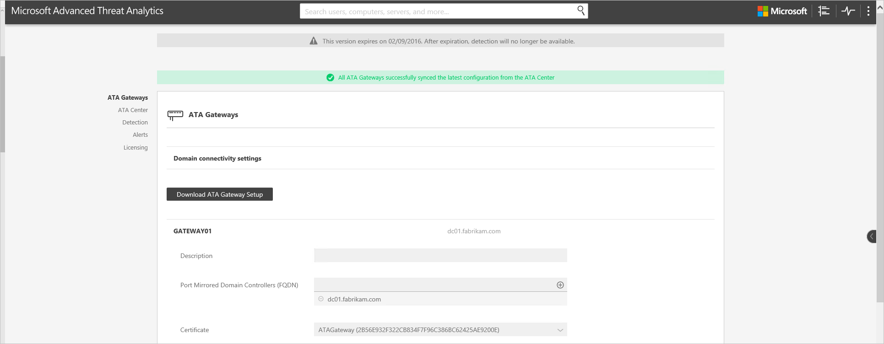

# Migrationshandbuch zur Aktualisierung auf ATA 1.6
Das Update auf ATA 1.6 bietet Verbesserungen in folgenden Bereichen:

-   Neue Erkennungen

-   Verbesserungen an vorhandenen Erkennungen

-   Das ATA-Lightweight-Gateway

-   Automatische Updates

-   Verbesserte ATA Center-Leistung

-   Niedrigere Speicheranforderungen

-   Unterstützung für IBM QRadar

## Aktualisieren von ATA auf Version 1.6
> [!NOTE] 
> Wenn ATA in Ihrer Umgebung nicht installiert ist, laden Sie die vollständige ATA-Version (enthält Version 1.6) herunter, und befolgen Sie die unter [Installieren von ATA](/advanced-threat-analytics/deploy-use/install-ata) beschriebene Standardinstallation.

Wenn ATA Version 1.5 bereits bereitgestellt wurde, zeigt die vorliegende Anleitung die für die Aktualisierung der Bereitstellung erforderlichen Schritte.

> [!NOTE] 
> ATA 1.6 kann nicht direkt auf ATA 1.4 installiert werden. Sie müssen zuerst ATA 1.5 installieren. Wenn Sie versehentlich versucht haben, ATA 1.6 zu installieren, ohne zuerst ATA 1.5 zu installieren, wird folgende Fehlermeldung angezeigt: **Auf Ihrem Computer ist bereits eine neuere Version installiert.** Sie müssen die Elemente von ATA 1.6, die trotz des Fehlers bei der Installation auf dem Computer verbleiben, deinstallieren, bevor Sie ATA 1.5 installieren.

So aktualisieren Sie auf ATA, Version 1.6:

1. Um Problem beim Upgrade zu vermeiden, stellen Sie sicher, dass Sie die Schritte 8 bis 10 unter **Migrationsfehler, wenn auf ATA 1.6 aktualisiert wird** befolgen, wie in [Neuerungen in ATA 1.6](whats-new-version-1.6.md) beschrieben.
2. Stellen Sie sicher, dass genügend freier Speicherplatz für das Upgrade verfügbar ist. Sie können die Installation bis zur Bereitschaftsprüfung ausführen, um herauszufinden, wie viel Speicherplatz in etwa benötigt wird. Anschließend können Sie das Upgrade erneut starten, nachdem Sie die erforderliche Datenträgerkapazität zugewiesen haben.
1.  [Herunterladen von Update 1.6](http://www.microsoft.com/evalcenter/evaluate-microsoft-advanced-threat-analytics) 
In dieser Version wird die gleiche Installationsdatei („Microsoft ATA Center Setup.exe“) für die Installation einer neuen Bereitstellung von ATA und zum Aktualisieren von vorhandener Bereitstellungen verwendet.

2.  Aktualisieren von ATA Center

3.  Downloaden des ATA-Gateway-Pakets

4.  Aktualisieren der ATA-Gateways

    > [!IMPORTANT]
    > Aktualisieren Sie alle ATA-Gateways, damit ATA ordnungsgemäß funktioniert.

### Schritt 1: Aktualisieren von ATA Center

1.  Sichern Sie die Datenbank (optional):

    -   Falls das ATA Center als virtueller Computer ausgeführt wird und Sie einen Prüfpunkt erstellen möchten, fahren Sie den virtuellen Computer zunächst herunter.

    -   Wenn ATA Center auf einem physischen Server ausgeführt wird, befolgen Sie die empfohlene Vorgehensweise zum [Sichern der MongoDB](https://docs.mongodb.org/manual/core/backups/).

2.  Führen Sie die Installationsdatei („Microsoft ATA Center Setup.exe“) aus, und befolgen Sie die Anweisungen auf dem Bildschirm, um das Update zu installieren.

    1.  Für ATA 1.6 muss .NET Framework 4.6.1 installiert sein. Wenn .NET Framework 4.6.1 noch nicht installiert ist, wird es als Teil der ATA-Installation installiert. 
    > [!NOTE]
    > Die Installation von .Net Framework 4.6.1 macht möglicherweise einen Neustart des Servers erforderlich. Die ATA-Installation wird erst nach dem Neustart des Servers fortgesetzt.
5.  Wählen Sie auf der Seite **Willkommen** Ihre Sprache aus, und klicken Sie auf **Weiter**.

    6.  Lesen Sie den Lizenzvertrag für Endbenutzer, und klicken Sie auf **Weiter**, sofern Sie die Lizenzbedingungen akzeptieren.

    7.  Jetzt können Sie ATA mithilfe von Microsoft Update auf dem neuesten Stand halten.  Wählen Sie auf der Microsoft Update-Seite **Microsoft Update für die Suche nach Updates verwenden (empfohlen)** aus.
     Damit ändern Sie die Windows-Einstellungen so, dass Updates für andere Microsoft-Produkte (einschließlich ATA) möglich sind, wie hier zu sehen. 
     

    8.  Vor Beginn der Installation führt ATA eine Bereitschaftsprüfung aus. Schauen Sie sich die Ergebnisse der Überprüfung an, um sicherzustellen, dass die erforderlichen Komponenten erfolgreich konfiguriert wurden und Sie mindestens über die Mindestmenge an Speicherplatz verfügen. 
    

    3.  Klicken Sie auf **Aktualisieren**. Nachdem Sie auf „Aktualisieren“ geklickt haben, ist ATA bis zum Abschluss der Aktualisierung offline.

4.  Nach der Aktualisierung von ATA Center melden die ATA-Gateways, dass sie veraltet sind.

    

> [!IMPORTANT] 
> Aktualisieren Sie alle ATA-Gateways, damit ATA ordnungsgemäß funktioniert.

### Schritt 2. Herunterladen des ATA-Gateway-Setuppakets
Nach dem Konfigurieren der Domänenverbindungseinstellungen können Sie das ATA-Gateway-Setuppaket herunterladen.

So laden Sie das ATA-Gateway-Paket herunter

1.  Löschen Sie alle zuvor heruntergeladenen früheren Versionen des ATA-Gateway-Pakets.

2.  Öffnen Sie auf dem ATA-Gatewaycomputer einen Browser, und geben Sie die IP-Adresse ein, die Sie in ATA Center für die ATA-Konsole konfiguriert haben. Klicken Sie in der geöffneten ATA-Konsole auf das Symbol „Einstellungen“, und wählen Sie **Konfiguration** aus.

    

3.  Klicken Sie auf der Registerkarte **ATA-Gateways** auf **ATA-Gatewaysetup herunterladen**.

4.  Speichern Sie das Paket lokal.

Die ZIP-Datei enthält Folgendes:

-   Installationsprogramm für ATA-Gateway

-   Konfigurationseinstellungsdatei mit den erforderlichen Informationen für die Verbindung mit ATA Center

### Schritt 3: Aktualisieren der ATA-Gateways

1.  Extrahieren Sie auf jedem ATA-Gateway die Dateien aus dem ATA-Gateway-Paket, und führen Sie die Datei **Microsoft ATA Gateway Setup.exe** aus.

    > [!NOTE] 
    > Sie können dieses ATA-Gateway-Paket auch verwenden, um neue ATA-Gateways zu installieren.

2.  Die vorherigen Einstellungen werden beibehalten, es kann jedoch einige Minuten dauern, bis der Dienst neu gestartet wird.

3.  Wiederholen Sie diesen Schritt für alle anderen bereitgestellten ATA-Gateways.

> [!NOTE] 
> Nach der erfolgreichen Aktualisierung eines ATA-Gateways wird die Benachrichtigung über die veraltete Version dieses Gateways ausgeblendet.

Alle ATA-Gateways wurden erfolgreich aktualisiert, wenn alle ATA-Gateways die erfolgreiche Synchronisierung melden und keine Meldungen über veraltete ATA-Gateways mehr angezeigt werden.

## Weitere Informationen

- [Weitere Informationen finden Sie im ATA-Forum.](https://social.technet.microsoft.com/Forums/security/home?forum=mata)

<!--HONumber=Sep16_HO4-->

