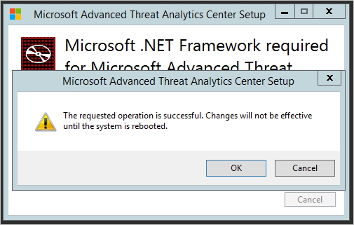

# Neuerungen in ATA 1.6
Die vorliegenden Anmerkungen zu dieser Version enthalten Informationen zu bekannten Problemen in dieser Version von Advanced Threat Analytics.

## Neuerungen beim Update auf ATA 1.6
Das Update auf ATA 1.6 bietet Verbesserungen in folgenden Bereichen:

-   Neue Erkennungen

-   Verbesserungen an vorhandenen Erkennungen

-   Das ATA-Lightweight-Gateway

-   Automatische Updates

-   Verbesserte ATA Center-Leistung

-   Niedrigere Speicheranforderungen

-   Unterstützung für IBM QRadar

### Neue Erkennungen

- **Böswillige Anforderung privater Informationen im Rahmen der Datensicherheit** Die Datenschutz-API (DPAPI) ist ein kennwortbasierter Datenschutzdienst. Dieser Schutzdienst wird von verschiedenen Clientanwendungen verwendet, die vertrauliche Informationen eines Benutzers, etwa Websitekennwörter und Anmeldeinformationen für Dateifreigaben, speichern. Um Fälle mit Kennwortverlust zu unterstützen, können Benutzer geschützte Daten mithilfe eines Wiederherstellungsschlüssels entschlüsseln, der nichts mit dem jeweiligen Kennwort zu tun hat. In einer Domänenumgebung können externe Angreifer den Wiederherstellungsschlüssel stehlen und diesen dazu verwenden, geschützte Daten auf allen zur Domäne gehörenden Computern zu entschlüsseln.

- **net session-Enumeration** Reconnaissance ist eine Hauptstufe in der erweiterten Kette der Angriffsabwehr. Domänencontroller (DCs) fungieren als Dateiserver für die Verteilung von Gruppenrichtlinienobjekten über das SMB-Protokoll (Server Message Block). Im Rahmen der Reconnaissancephase können Angreifer den DC hinsichtlich aller aktiven SMB-Sitzungen auf dem Server abfragen. Dies ermöglicht ihnen Zugriff auf alle Benutzer und IP-Adressen, die diesen SMB-Sitzungen zugeordnet sind. SMB-Sitzungsenumeration kann von Angreifern verwendet werden, auf vertrauliche Konten abzuzielen, wodurch sie sich quer (seitlich) durch das Netzwerk bewegen können.

- **Böswillige Replikationsanforderungen** In Active Directory-Umgebungen erfolgt regelmäßig eine Replikation zwischen Domänencontrollern. Ein Angreifer kann eine Active Directory-Replikationsanforderung (manchmal durch Annehmen der Identität eines Domänencontrollers) vortäuschen, wodurch es dem Angreifer gestattet wird, die in Active Directory gespeicherten Daten abzurufen, einschließlich Kennworthashes, ohne auffallendere Techniken wie Volumeschattenkopie zu nutzen.

- **Erkennung des MS11-013-Sicherheitsrisikos** Es gibt eine Erhöhung des Berechtigungssicherheitsrisikos in Kerberos, die es für bestimmte Aspekte eines Kerberos-Diensttickets ermöglicht, dass es gefälscht wird. Ein böswilliger Benutzer oder ein Angreifer, der dieses Sicherheitsrisiko Anfälligkeiten erfolgreich ausnutzt, kann ein Token mit erhöhten Rechten auf dem Domänencontroller abrufen.

- **Ungewöhnliche Protokollimplementierung** Authentifizierungsanforderungen (Kerberos oder NTLM) erfolgen in der Regel über einen standardmäßigen Satz von Methoden und Protokollen. Für eine erfolgreiche Authentifizierung muss die Anforderung jedoch nur einen bestimmten Satz von Anforderungen erfüllen. Angreifer können diese Protokolle mit geringfügigen Abweichungen von der Standardimplementierung in der Umgebung implementieren. Diese Abweichungen können die Anwesenheit eines Angreifers kennzeichnen, der versucht, Angriffe wie Pass-The-Hash, Brute-Force oder andere auszuführen.

### Verbesserungen an vorhandenen Erkennungen
ATA-1.6 enthält verbesserte Erkennungslogik, die falsch positive und falsch negative Szenarien für vorhandene Erkennungen wie Golden Ticket, Honeytoken, Brute-Force und Remoteausführung verringert.

### Das ATA-Lightweight-Gateway
Ab dieser Version von ATA gibt es eine neue Bereitstellungsoption für das ATA-Gateway, die es ermöglicht, ein ATA-Gateway direkt auf dem Domänencontroller zu installieren. Diese Bereitstellungsoption entfernt nicht kritische Funktionalität des ATA-Gateways und führt dynamische Ressourcenverwaltung entsprechend den auf dem DC verfügbaren Ressourcen ein. Dadurch ist sicherstellt, dass die vorhandenen Vorgänge des DCs nicht betroffen sind. Das ATA-Lightweight-Gateway reduziert die Kosten der ATA-Bereitstellung. Gleichzeitig vereinfacht es die Bereitstellung in Filialstandorten, in denen es begrenzte Hardwareressourcen oder keine Möglichkeit gibt, Unterstützung für Portspiegelung einzurichten.
Weitere Informationen zum ATA-Lightweight-Gateway finden Sie unter [ATA-Architektur](/advanced-threat-analytics/plan-design/ata-architecture#ata-gateway-and-ata-lightweight-gateway).

Weitere Informationen zu Bereitstellungsüberlegungen und zum Auswählen des für Sie richtigen Gatewaytyps finden Sie unter [ATA-Kapazitätsplanung](/advanced-threat-analytics/plan-design/ata-capacity-planning#choosing-the-right-gateway-type-for-your-deployment).

### Automatische Updates
Ab Version 1.6 kann ATA Center mit Microsoft Update aktualisiert werden. Darüber hinaus können die ATA-Gateways jetzt automatisch aktualisiert werden, wobei deren Standardkommunikationskanal zu ATA Center verwendet wird.
### Verbesserte ATA Center-Leistung
Ab dieser Version ermöglichen eine kleinere Datenbanklast und ein effizienteres Ausführen aller Erkennungen, dass viel mehr Domänencontroller mit einem einzigen ATA Center überwacht werden können.

### Niedrigere Speicheranforderungen
ATA 1.6 erfordert erheblich weniger Speicherplatz zum Ausführen der ATA-Datenbank: Es erfordert nur noch 20 % des Speicherplatzes, der in früheren Versionen verwendet wird.

### Unterstützung für IBM QRadar
ATA kann nun Ereignisse von IBMs SIEM-Lösung QRadar zusätzlich zu den zuvor unterstützten SIEM-Lösungen empfangen.

## Bekannte Probleme
In dieser Version bestehen die folgenden bekannten Probleme.

### Fehler beim Erkennen eines neuen Pfads in manuell verschobenen Datenbanken

In Bereitstellungen, in denen der Datenbankpfad manuell verschoben wird, verwendet die ATA-Bereitstellung nicht den neuen Datenbankpfad für die Aktualisierung. Dies kann die folgenden Probleme verursachen:

- ATA verwendet möglicherweise den gesamten freien Speicherplatz auf dem Systemlaufwerk von ATA Center, ohne alte Netzwerkaktivitäten regelmäßig zu löschen.

- Beim Aktualisieren von ATA auf Version 1.6 tritt bei den vorbereitenden Bereitschaftsprüfungen möglicherweise ein Fehler auf (siehe folgende Abbildung).
    
    >[!Important]
Vor dem Aktualisieren von ATA auf Version 1.6 müssen Sie den folgenden Registrierungsschlüssel mit dem richtigen Datenbankpfad aktualisieren:  `HKEY_LOCAL_MACHINE\SOFTWARE\Microsoft\Microsoft Advanced Threat Analytics\Center\DatabaseDataPath`

### Migrationsfehler, wenn von ATA 1.5 aktualisiert wird
Beim Aktualisieren auf ATA 1.6 kann der Aktualisierungsvorgang mit dem folgenden Fehlercode fehlschlagen:

 Wird dieser Fehler angezeigt, überprüfen Sie das Bereitstellungsprotokoll **C:\Benutzer\<Benutzer>\AppData\Local\Temp**, und suchen Sie nach der folgenden Ausnahme:

    System.Reflection.TargetInvocationException: Exception has been thrown by the target of an invocation. ---> MongoDB.Driver.MongoWriteException: A write operation resulted in an error. E11000 duplicate key error index: ATA.UniqueEntityProfile.$_id_ dup key: { : "<guid>" } ---> MongoDB.Driver.MongoBulkWriteException`1: A bulk write operation resulted in one or more errors.  E11000 duplicate key error index: ATA.UniqueEntityProfile.$_id_ dup key: { : " <guid> " }

Möglicherweise wird auch dieser Fehler angezeigt: System.ArgumentNullException: Der Wert darf nicht NULL sein.
    
Wenn einer dieser Fehler angezeigt wird, führen Sie die folgenden Schritte zur Problemumgehung aus.

**Problemumgehung**: 

1.    Verschieben Sie den Ordner „data_old“ in einen temporären Ordner (befindet sich normalerweise in „%ProgramFiles%\Microsoft Advanced Threat Analytics\Center\MongoDB\bin“).
2.    Deinstallieren Sie ATA Center 1.5, und löschen Sie alle Datenbankdaten.

3.    Installieren Sie ATA Center 1.5 erneut. Verwenden Sie dieselbe Konfiguration wie bei der vorherigen ATA 1.5-Installation (Zertifikate, IP-Adressen, Datenbankpfad usw.).
4.    Beenden Sie diese Dienste in der folgenden Reihenfolge:
    1.    Microsoft Advanced Threat Analytics Center
    2.    MongoDB
5.    Ersetzen Sie die MongoDB-Datenbankdateien durch die Dateien im Ordner „data_old“.
6.    Starten Sie diese Dienste in der folgenden Reihenfolge:
    1.    MongoDB
    2.    Microsoft Advanced Threat Analytics Center
7.    Überprüfen Sie die Protokolle, um sich zu vergewissern, dass das Produkt ohne Fehler ausgeführt wird.
8.    [Herunterladen](http://aka.ms/ataremoveduplicateprofiles "Laden Sie das Tool „RemoveDuplicateProfiles.exe“ herunter"), und kopieren Sie es in den Hauptinstallationspfad (%ProgramFiles%\Microsoft Advanced Threat Analytics\Center).
9.    Führen Sie „RemoveDuplicateProfiles.exe“ von einer Eingabeaufforderung mit erhöhten Rechten aus, und warten Sie, bis das Tool erfolgreich abgeschlossen wurde.
10.    Fahren Sie wie folgt fort: …\Microsoft Advanced Threat Analytics\Center\MongoDB\bin: **Mongo ATA**; geben Sie folgenden Befehl ein:

    db.SuspiciousActivities.remove({ "_t" : "RemoteExecutionSuspiciousActivity", "DetailsRecords" : { "$elemMatch" : { "ReturnCode" : null } } }, { "_id" : 1 });

Es sollte ein WriteResult({ "nRemoved" : XX })-Wert zurückgegeben werden, wobei „XX“ der Anzahl von verdächtigen Aktivitäten entspricht, die gelöscht wurden. Wenn der Wert größer als 0 ist, beenden Sie die Eingabeaufforderung, und fahren Sie mit dem Updatevorgang fort.

### .NET Framework 4.6.1 erfordert einen Neustart des Servers

In einigen Fällen erfordert die Installation von .NET Framework 4.6.1 möglicherweise einen Neustart des Servers. Wenn Sie im Dialogfeld **Microsoft Advanced Threat Analytics Center Setup** auf „OK“ klicken, wird der Server automatisch neu gestartet. Dies ist insbesondere wichtig, wenn das ATA-Lightweight-Gateway auf einem Domänencontroller installiert wird, denn möglicherweise möchten Sie ein Wartungsfenster vor der Installation planen.
    

### Frühere Netzwerkaktivitäten werden nicht mehr migriert
Diese Version von ATA umfasst ein verbessertes Erkennungsmodul, das eine genauere Erkennung bietet und viele falsch positive Szenarien eliminiert, insbesondere für Pass-the-Hash.
Für das neue und verbesserte Erkennungsmodul wird Inline-Erkennungstechnologie genutzt, die eine Erkennung ohne Auswertung früherer Netzwerkaktivitäten ermöglicht, um die Leistung von ATA Center erheblich zu erhöhen. Dies bedeutet auch, dass es nicht erforderlich ist, frühere Netzwerkaktivitäten während des Aktualisierungsvorgangs zu migrieren.
Im ATA-Aktualisierungsvorgang werden die Daten für den Fall, dass Sie diese für zukünftige Untersuchungen benötigen, als JSON-Datei in `
\Migration` exportiert.

## Weitere Informationen
[Weitere Informationen finden Sie im ATA-Forum.](https://social.technet.microsoft.com/Forums/security/home?forum=mata)

[Aktualisieren von ATA auf Version 1.6 – Migrationsleitfaden](ata-update-1.6-migration-guide.md)