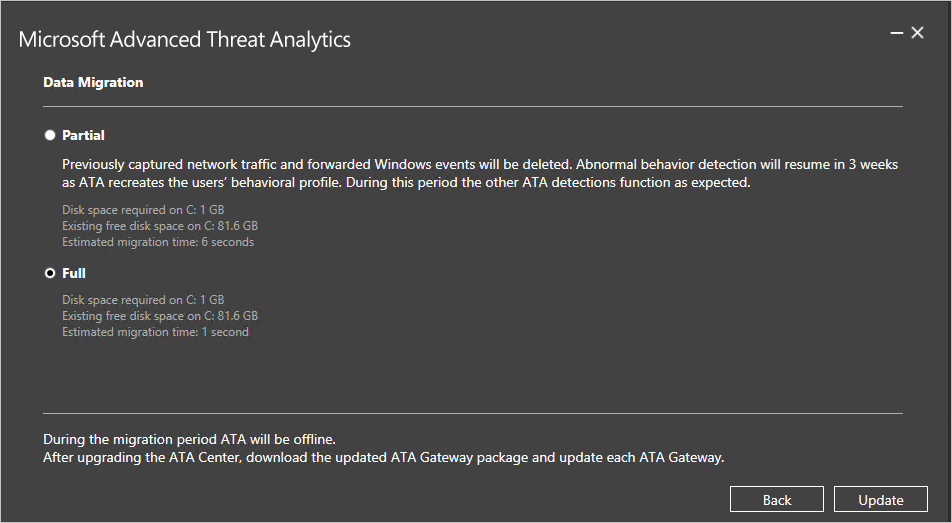

# Migrationshandbuch zur Aktualisierung auf ATA 1.5
Das Update auf ATA 1.5 bietet Verbesserungen in folgenden Bereichen:

-   Schnellere Erkennung

-   Verbesserter automatischer Erkennungsalgorithmus für NAT-Geräte (Network Address Translation, Netzwerkadressübersetzung)

-   Verbessertes Namensauflösungsverfahren für nicht mit einer Domäne verbundene Geräte

-   Unterstützung für die Datenmigration während Produktupdates

-   Bessere Reaktionsfähigkeit der Benutzeroberfläche auf verdächtige Aktivitäten mit Tausenden von beteiligten Entitäten

-   Verbesserte automatische Auflösung von Überwachungswarnungen

-   Zusätzliche Leistungsindikatoren für die erweiterte Überwachung und Problembehandlung

## Aktualisieren von ATA auf Version 1.5
> [!NOTE]
> Wenn ATA in Ihrer Umgebung nicht installiert ist, laden Sie die vollständige ATA-Version (enthält Version 1.5) herunter, und befolgen Sie die unter [Installieren von ATA](install-ata-step1.md) beschriebene Standardinstallation.

Wenn ATA Version 1.4 bereits bereitgestellt wird, zeigt die vorliegende Anleitung die für die Aktualisierung der Installation erforderlichen Schritte.

So aktualisieren Sie auf ATA, Version 1.5:

1.  Laden Sie ATA v1.5 aus dem VLSC oder von MSDN herunter.
      > [!NOTE]
      > Sie können zur Aktualisierung auf Version 1.5 auch die aktualisierte vollständige Version von ATA verwenden.

2.  Aktualisieren von ATA Center

3.  Downloaden des ATA-Gateway-Pakets

4.  Aktualisieren der ATA-Gateways

    > [!IMPORTANT]
    > Aktualisieren Sie alle ATA-Gateways, damit ATA ordnungsgemäß funktioniert.

### Schritt 1: Aktualisieren von ATA Center

1.  Sichern Sie die Datenbank (optional):

    -   Falls ATA Center als virtueller Computer ausgeführt wird und Sie einen Prüfpunkt erstellen möchten, fahren Sie den virtuellen Computer zunächst herunter.

    -   Wenn ATA Center auf einem physischen Server ausgeführt wird, befolgen Sie die empfohlene Vorgehensweise zum [Sichern der MongoDB](https://docs.mongodb.org/manual/core/backups/).

2.  Führen Sie die Updatedatei („Microsoft ATA Center Update.exe“) aus, und befolgen Sie die Anweisungen auf dem Bildschirm, um das Update zu installieren.

    1.  Wählen Sie auf der Seite **Willkommen** Ihre Sprache aus, und klicken Sie auf **Weiter**.

    2.  Lesen Sie den Lizenzvertrag für Endbenutzer, markieren Sie das Kontrollkästchen, und klicken Sie auf **Weiter**, sofern Sie die Lizenzbedingungen akzeptieren.

    3.  Wählen Sie aus, ob Sie die vollständige (Standard) oder teilweise Migration ausführen möchten.

        

        -   Wenn Sie die **teilweise** Migration auswählen, werden der bisher gesammelte Netzwerkverkehr sowie die von ATA analysierten weitergeleiteten Windows-Ereignisse gelöscht, und die Verhaltensprofile müssen neu erlernt werden. Dieser Vorgang dauert mindestens drei Wochen. Bei wenig verbleibendem Speicherplatz auf dem Datenträger ist die Durchführung einer **teilweisen** Migration von Vorteil.

        -   Wenn Sie die **vollständige** Migration ausführen, ist gemäß den diesbezüglichen Berechnungen auf der Upgradeseite zusätzlicher Speicherplatz erforderlich, und die Migration kann je nach Netzwerkdatenverkehr länger dauern. Bei der vollständigen Migration werden alle zuvor gesammelten Daten und Verhaltensprofile beibehalten, sodass kein zusätzlicher Zeitaufwand durch das Neulernen von Verhaltensprofilen durch ATA entsteht, und Verhaltensanomalien können direkt nach der Aktualisierung erkannt werden.

3.  Klicken Sie auf **Aktualisieren**. Nachdem Sie auf „Aktualisieren“ geklickt haben, ist ATA bis zum Abschluss der Aktualisierung offline.

4.  Nach der Aktualisierung von ATA Center melden die ATA-Gateways, dass sie veraltet sind.

    

> [!IMPORTANT]
> - Aktualisieren Sie alle ATA-Gateways, damit ATA ordnungsgemäß funktioniert.

### Schritt 2. Herunterladen des ATA-Gateway-Setuppakets
Nach dem Konfigurieren der Domänenverbindungseinstellungen können Sie das ATA-Gateway-Setuppaket herunterladen.

So laden Sie das ATA-Gateway-Paket herunter

1.  Löschen Sie alle zuvor heruntergeladenen früheren Versionen des ATA-Gateway-Pakets.

2.  Öffnen Sie auf dem ATA-Gatewaycomputer einen Browser, und geben Sie die IP-Adresse ein, die Sie in ATA Center für die ATA-Konsole konfiguriert haben. Klicken Sie in der geöffneten ATA-Konsole auf das Symbol „Einstellungen“, und wählen Sie **Konfiguration** aus.

    

3.  Klicken Sie auf der Registerkarte **ATA-Gateways** auf **ATA-Gatewaysetup herunterladen**.

4.  Speichern Sie das Paket lokal.

Die ZIP-Datei enthält die folgenden Dateien:

-   Installationsprogramm für ATA-Gateway

-   Konfigurationseinstellungsdatei mit den erforderlichen Informationen für die Verbindung mit ATA Center

### Schritt 3: Aktualisieren der ATA-Gateways

1.  Extrahieren Sie auf jedem ATA-Gateway die Dateien aus dem ATA-Gateway-Paket, und führen Sie die Datei „Microsoft ATA Gateway Setup“ aus.

    > [!NOTE]
    > Sie können dieses ATA-Gateway-Paket auch verwenden, um neue ATA-Gateways zu installieren.

2.  Die vorherigen Einstellungen werden beibehalten, es kann jedoch einige Minuten dauern, bis der Dienst neu gestartet wird.

3.  Wiederholen Sie diesen Schritt für alle anderen bereitgestellten ATA-Gateways.

> [!NOTE]
> Nach der erfolgreichen Aktualisierung eines ATA-Gateways wird die Benachrichtigung über die veraltete Version dieses Gateways ausgeblendet.

Alle ATA-Gateways wurden erfolgreich aktualisiert, wenn alle ATA-Gateways die erfolgreiche Synchronisierung melden und keine Meldungen über veraltete ATA-Gateways mehr angezeigt werden.

## Weitere Informationen

- [Weitere Informationen finden Sie im ATA-Forum.](https://social.technet.microsoft.com/Forums/security/home?forum=mata)
