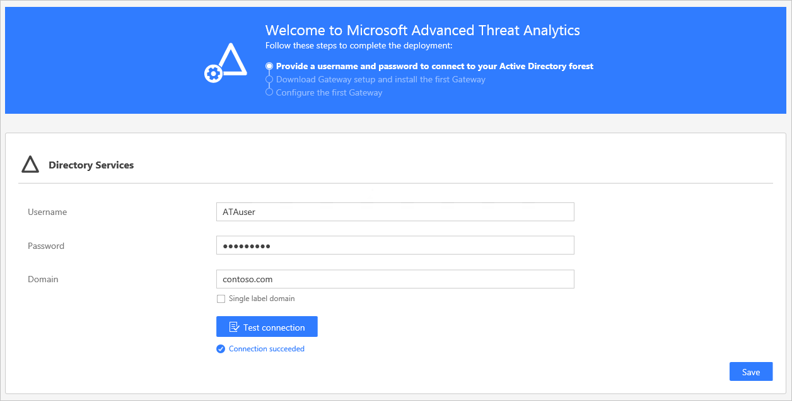

# Installieren von ATA – Schritt 2

*Gilt für: Advanced Threat Analytics Version 1.9*

> [!div class="step-by-step"]
> [« Schritt 1](install-ata-step1.md)
> [Schritt 3 »](install-ata-step3.md)

## Schritt 2. Geben Sie einen Benutzernamen und ein Kennwort an, um eine Verbindung mit Ihrer Active Directory-Gesamtstruktur herzustellen

Beim ersten Öffnen der ATA-Konsole wird der folgende Bildschirm angezeigt:

1.  Geben Sie die folgenden Informationen ein, und klicken Sie anschließend auf **Speichern**.

    |Feld|Kommentare|
    |---------|------------|
    |**Benutzername** (erforderlich)|Geben Sie den schreibgeschützten Benutzernamen ein, z. B. **ATAuser**. **Hinweis:** Verwenden Sie **nicht** das UPN-Format für Ihren Benutzernamen.|
    |**Kennwort** (erforderlich)|Geben Sie das Kennwort für den schreibgeschützten Benutzer ein. Beispiel: **Pencil1**.|
    |**Domäne** (erforderlich)|Geben Sie die Domäne für den schreibgeschützten Benutzer ein, z. B. **contoso.com**. **Hinweis:** Es ist wichtig, dass Sie den vollqualifizierten Domänennamen (FQDN) der Domäne eingeben, in der sich das Benutzerkonto befindet. Wenn sich das Konto des Benutzers beispielsweise in der Domäne „corp.contoso.com“ befindet, müssen Sie `corp.contoso.com` und nicht „contoso.com“ eingeben.|

2. Sie können auf **Testverbindung** klicken, um die Konnektivität zur Domäne zu testen und um zu prüfen, ob der Zugriff mit den bereitgestellten Anmeldeinformationen erfolgreich ist. Dies ist möglich, wenn ATA Center mit der Domäne verbunden ist.    

    Nachdem Ihre Eingaben gespeichert wurden, ändert sich die Willkommensnachricht in der Konsole folgendermaßen: 

3. Klicken Sie in der Konsole auf **Download Gateway setup and install the first Gateway** (Herunterladen des Gateway-Setups und Installieren des ersten Gateways) um den Vorgang fortzusetzen.

> [!div class="step-by-step"]
> [« Schritt 1](install-ata-step1.md)
> [Schritt 3 »](install-ata-step3.md)

## Weitere Informationen
## Verwandte Videos
- [Übersicht über die ATA-Bereitstellung](https://channel9.msdn.com/Shows/Microsoft-Security/Overview-of-ATA-Deployment-in-10-Minutes)
- [Auswählen des richtigen ATA-Gatewaytyps](https://channel9.msdn.com/Shows/Microsoft-Security/ATA-Deployment-Choose-the-Right-Gateway-Type)

## Weitere Informationen
- [Handbuch für die ATA POC-Bereitstellung](http://aka.ms/atapoc)
- [Tool zur Bemessung von ATA-Gateways](http://aka.ms/atasizingtool)
- [Weitere Informationen finden Sie im ATA-Forum.](https://social.technet.microsoft.com/Forums/security/home?forum=mata)
- [Konfigurieren der Ereignissammlung](configure-event-collection.md)
- [Voraussetzungen für ATA](ata-prerequisites.md)
