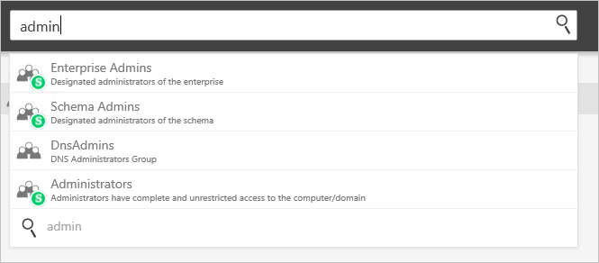

*Gilt für: Advanced Threat Analytics Version 1.9*

# Arbeiten mit der ATA-Konsole

Verwenden Sie die ATA-Konsole, um die von ATA erkannten verdächtigen Aktivitäten zu überwachen und darauf zu reagieren.

Durch Drücken der `?`-Taste werden die Tastenkombinationen für den Zugriff auf das ATA-Portal bereitgestellt. 

## Aktivieren des Zugriffs auf die ATA-Konsole
Sie müssen sich mit einem Benutzer anmelden, dem die richtige ATA-Rolle für den Zugriff auf die ATA-Konsole zugewiesen wurde, damit die Anmeldung bei der Konsole erfolgreich verläuft. Weitere Informationen zur rollenbasierten Zugriffssteuerung in ATA finden Sie unter [ATA-Rollengruppen](ata-role-groups.md).

## Anmelden bei der ATA-Konsole

>[!NOTE]
 > Ab ATA 1.8 erfolgt die Anmeldung in der ATA-Konsole über das einmalige Anmelden.

1. Klicken Sie auf dem Desktop des ATA Center-Servers auf das Symbol für die **Microsoft ATA-Konsole**, oder öffnen Sie einen Browser, und navigieren Sie zur ATA-Konsole.

    

 >[!NOTE]
 > Sie können auch entweder in ATA Center oder auf dem ATA-Gateway einen Browser öffnen und zu der IP-Adresse navigieren, die Sie während der ATA Center-Installation für die ATA-Konsole konfiguriert haben.    

2.  Wenn der Computer, auf dem ATA Center installiert ist, und der Computer, von dem aus Sie auf die ATA-Konsole zugreifen möchten, beide in eine Domäne eingebunden sind, unterstützt ATA das in der Windows-Authentifizierung integrierte einmalige Anmelden. Wenn Sie bereits bei Ihrem Computer angemeldet sind, verwendet ATA dieses Token, um Sie bei der ATA-Konsole anzumelden. Sie können sich auch mit einer Smartcard anmelden. Ihre Berechtigungen in ATA entsprechen Ihrer [Administratorrolle](ata-role-groups.md).

 > [!NOTE]
 > Stellen Sie sicher, dass Sie sich bei dem Computer anmelden, von dem aus Sie auf die ATA-Konsole zugreifen möchten. Verwenden Sie hierzu Ihren ATA-Administratorbenutzernamen und das dazugehörige Kennwort. Alternativ können Sie Ihren Browser als ein anderer Benutzer ausführen oder sich von Windows abmelden und danach mit Ihrem ATA-Administratorbenutzerkonto anmelden. Damit die ATA-Konsole nach Anmeldeinformationen fragt, greifen Sie mithilfe einer IP-Adresse auf die Konsole zu. Sie werden aufgefordert, Anmeldeinformationen einzugeben.

3. Stellen Sie bei der Anmeldung mit SSO sicher, dass der Standort der ATA-Konsole als lokale Intranetsite in Ihrem Browser definiert ist und dass Sie mit einem Kurznamen oder einem Localhost darauf zugreifen.

> [!NOTE]
> Zusätzlich zum Protokollieren jeder verdächtigen Aktivität und Integritätswarnung wird jede Konfigurationsänderung, die Sie in der ATA-Konsole vornehmen, im Windows-Ereignisprotokoll auf dem ATA Center-Computer unter **Applications and services log** (Protokoll für Anwendungen und Dienste) und dann unter **Microsoft ATA** überprüft. Es wird ebenso jede Anmeldung bei der ATA-Konsole überprüft.    Eine Konfiguration, die das ATA-Gateway betrifft, wird auch im Windows-Ereignisprotokoll des ATA-Gateway-Computers protokolliert. 

## Die ATA-Konsole

Die ATA-Konsole stellt Ihnen einen schnellen Überblick über alle verdächtigen Aktivitäten in zeitlicher Reihenfolge zur Verfügung. Sie ermöglicht es Ihnen, sich die Details einer Aktivität anzusehen und Aktionen entsprechend der jeweiligen Aktivität auszuführen. Die Konsole zeigt außerdem Warnungen und Benachrichtigungen an, um Probleme mit dem ATA-Netzwerk oder neue Aktivitäten hervorzuheben, die als verdächtig eingestuft werden.

Dies sind die wichtigsten Elemente der ATA-Konsole.

### Angriffszeitachse

Dies ist die Standardzielseite, auf die Sie gelangen, wenn Sie sich bei der ATA-Konsole anmelden. Standardmäßig werden alle offenen verdächtigen Aktivitäten auf der Angriffszeitachse angezeigt. Sie können die Angriffszeitachse filtern, um alle bzw. offene, verworfene oder unterdrückte verdächtige Aktivitäten anzuzeigen. Außerdem wird der Schweregrad angezeigt, der den einzelnen Aktivitäten zugewiesen wurde.

Weitere Informationen finden Sie unter [Arbeiten mit verdächtigen Aktivitäten](working-with-suspicious-activities.md).

### Benachrichtigungsleiste

Wenn eine neue verdächtige Aktivität erkannt wird, öffnet sich auf der rechten Seite automatisch die Benachrichtigungsleiste. Wenn seit Ihrer letzten Anmeldung neue verdächtige Aktivitäten erkannt wurden, wird die Benachrichtigungsleiste geöffnet, nachdem Sie sich erfolgreich angemeldet haben. Sie können jederzeit auf den Pfeil auf der rechten Seite klicken, um auf die Benachrichtigungsleiste zuzugreifen.

### Neuheiten

Nach der Veröffentlichung einer neuen Version von ATA wird das Fenster **Neuigkeiten** in der oberen rechten Ecke angezeigt. Darüber erhalten Sie Informationen dazu, was in der neusten Version hinzugefügt wurde. Außerdem erhalten Sie einen Link zum Download der Version.

### Filterbereich

Sie können basierend auf Status und Schweregrad filtern, welche verdächtigen Aktivitäten auf der Angriffszeitachse oder auf der Registerkarte für verdächtige Aktivitäten des Entitätsprofils angezeigt werden.

### Suchleiste

Im obersten Menü finden Sie eine Suchleiste. Sie können nach einem bestimmten Benutzer, einem Computer oder nach Gruppen in ATA suchen. Beginnen Sie als Versuch einfach mit der Eingabe.

### Integritätscenter

Das Integritätscenter warnt Sie, wenn in Ihrer ATA-Bereitstellung etwas nicht ordnungsgemäß funktioniert.

Jedes Mal, wenn auf Ihrem System ein Problem auftritt (z.B. ein Verbindungsfehler oder ein getrenntes ATA-Gateway), können Sie dies am Symbol für das Integritätscenter erkennen, auf dem ein roter Punkt angezeigt wird. 

### Sensible Gruppen

Die folgende Liste von Gruppen werden von ATA als **sensibel** eingestuft. Jede Entität, die Mitglied dieser Gruppen ist, wird als sensibel angesehen:

- Domänencontroller der Organisation ohne Schreibzugriff 
- Domänen-Admins 
- Domänencontroller 
- Schema-Admins
- Organisations-Admins 
- Gruppenrichtlinienersteller-Besitzer 
- Schreibgeschützter Domänencontroller 
- Administratoren  
- Hauptbenutzer  
- Konten-Operatoren  
- Server-Operatoren   
- Druck-Operatoren
- Sicherungsoperatoren
- Replikatoren 
- Remotedesktopbenutzer 
- Netzwerkkonfigurations-Operatoren 
- Eingehende Gesamtstruktur-Vertrauensstellung 
- DNS-Administratoren 

### Miniprofil

Wenn Sie an einer Stelle in der Konsole, an der eine einzelne Entität dargestellt wird (z.B. ein Benutzer oder ein Computer), mit der Maus auf eine Entität zeigen, wird automatisch ein Miniprofil geöffnet. Das Miniprofil enthält die folgenden Informationen (sofern verfügbar):

-   Name

-   Bild

-   E-Mail

-   Telefon

-   Anzahl der verdächtigen Aktivitäten nach Schweregrad

## Weitere Informationen
[Weitere Informationen finden Sie im ATA-Forum.](https://social.technet.microsoft.com/Forums/security/home?forum=mata)
