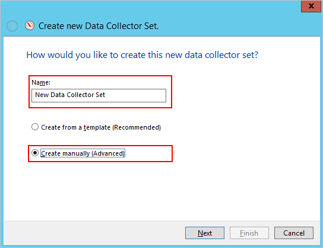

*Gilt für: Azure Advanced Threat Protection*

# Azure ATP-Kapazitätsplanung
In diesem Artikel erfahren Sie, wie viele Azure ATP-Sensoren und eigenständige Azure ATP-Sensoren Sie benötigen.

> [!NOTE] 
> Das Tool zur Größenanpassung verfügt über zwei Blätter: eins für ATA und eins für Azure ATP. Stellen Sie sicher, dass Sie sich auf dem richtigen Blatt befinden.

## Verwenden das Tools zur Größenanpassung
Die empfohlene und einfachste Methode zum Ermitteln der Kapazität für die Azure ATP-Bereitstellung besteht in der Verwendung des [Azure ATP-Tools zur Größenanpassung](http://aka.ms/aatpsizingtool). Führen Sie das Azure ATP-Tool zur Größenanpassung aus, und verwenden Sie aus den Ergebnis der Excel-Datei die folgenden Felder zum Ermitteln des vom Sensor benötigten Speichers und der CPU:

- Azure ATP-Sensor: Ordnen Sie das Feld **Busy Packets/sec** (Belegte Pakete pro Sek.) in der Azure ATP-Sensortabelle in der Ergebnisdatei dem Feld **PAKETE PRO SEKUNDE** in der [Eigenständigen Azure ATP-Sensor-Tabelle](#azure-atp-sensor-sizing) oder der [Azure ATP-Sensor-Tabelle](#azure-atp-standalone-sensor-sizing) zu, abhängig vom [gewählten Sensortyp](#choosing-the-right-sensor-type-for-your-deployment).

Wenn Sie das Azure ATP-Tool zur Größenanpassung nicht verwenden können, sammeln Sie die Informationen zum Leistungsindikator „Pakete pro Sek.“ manuell von allen Domänencontrollern über einen Zeitraum von 24 Stunden mit einem niedrigen Erfassungsintervall (etwa 5 Sekunden). Anschließend müssen Sie für jeden Domänencontroller den Tagesdurchschnitt und den Durchschnitt der Zeitspanne (15 Minuten) mit der höchsten Auslastung berechnen.
Die folgenden Abschnitte enthalten Anweisungen dazu, wie Sie Informationen zum Pakete/Sek.-Leistungsindikator für einen Domänencontroller sammeln.

## Auswählen des richtigen Sensortyps für die Bereitstellung
In einer Azure ATP-Bereitstellung wird jede Kombination aus den Typen des eigenständigen Azure ATP-Sensors unterstützt:

- Nur eigenständige Azure ATP-Sensoren
- Nur Azure ATP-Sensor
- Eine Kombination aus beiden Typen

Berücksichtigen Sie folgende Vorteile bei der Auswahl des Bereitstellungstyps des Sensors:

|Sensortyp|Vorteile|Kosten|Bereitstellungstopologie|Domänencontrollerverwendung|
|----|----|----|----|-----|
|Eigenständiger Azure ATP-Sensor|Eine Out-of-Band-Bereitstellung erschwert es Angreifern, herauszufinden, ob Azure ATP vorhanden ist.|Höher|Neben dem Domänencontroller installiert (out-of-band).|Unterstützt bis zu 100.000 Pakete pro Sekunde.|
|Azure ATP-Sensor|Erfordert keinen dedizierten Server und keine Konfiguration der Portspiegelung.|Kleinschreibung|Auf dem Domänencontroller installiert.|Unterstützt bis zu 100.000 Pakete pro Sekunde.|

Berücksichtigen Sie folgende Fehler bei der Entscheidung, wie viele eigenständige Azure ATP-Sensoren bereitgestellt werden sollen.

-   **Active Directory-Gesamtstrukturen und -Domänen** 
    Azure ATP kann Datenverkehr aus mehreren Domänen innerhalb einer einzelnen Active Directory-Gesamtstruktur für jeden Arbeitsbereich überwachen, den Sie erstellen. Sie müssen mehrere Arbeitsbereiche erstellen, um mehrere Gesamtstrukturen überwachen zu können. 

-   **Portspiegelung** 
Die Durchführung der Portspiegelung erfordert möglicherweise die Bereitstellung mehrerer eigenständiger Azure ATP-Sensoren pro Rechenzentrum oder Filialstandort.

-   **Kapazität** 
    Ein eigenständiger Azure ATP-Sensor kann die Überwachung von mehreren Domänencontrollern unterstützen, abhängig vom Umfang des Datenverkehrs des überwachten Domänencontrollers. 

## Größenanpassung des Azure ATP-Sensors und des eigenständigen Azure ATP-Sensors 

Ein Azure ATP-Sensor kann die Überwachung eines Domänencontrollers basierend auf der Menge des vom Domänencontroller erzeugten Datenverkehrs unterstützen. Die folgende Tabelle ist eine Schätzung – die tatsächliche vom Sensor analysierte Menge ist abhängig vom Datenverkehr und dessen Verteilung. 
> [!NOTE]
> Die folgende CPU- und Arbeitsspeicherkapazität bezieht sich auf die Auslastung des Sensors selbst und nicht auf die Domänencontrollerkapazität.

|Pakete pro Sekunde*|CPU (Kerne)|Arbeitsspeicher (GB)|
|----|----|-----|
|0 – 1.000|0,25|2,50|
|1.000 – 5.000|0,75|6,00|
|5.000 – 10.000|1,00|6,50|
|10.000 – 20.000|2,00|9,00|
|20.000 – 50.000|3,50|9,50|
|50.000 – 75.000 |3,50|9,50|
|75.000 – 100.000|3,50 |9,50|

> [!NOTE]
> - Gesamtanzahl der vom Sensordienst verwendeten Kerne Es wird empfohlen, nicht mit Hyperthreadingkernen zu arbeiten.
> - Gesamtarbeitsspeicher, der vom Sensordienst verwendet wird
> -   Wenn der Domänencontroller nicht über die für den Azure ATP-Sensor erforderlichen Ressourcen verfügt, wird die Leistung des Domänencontrollers zwar nicht beeinträchtigt, aber der Azure ATP-Sensor funktioniert möglicherweise nicht wie erwartet.
> -   Bei Ausführung als virtueller Computer wird kein dynamischer Arbeitsspeicher und keine andere Speichererweiterungsfunktion unterstützt.
> -   Um eine optimale Leistung zu erzielen, legen Sie die **Energieoption** des Azure ATP-Sensors auf **Hohe Leistung** fest.
> -   Es werden mindestens 2 Kerne und 6 GB Speicherplatz benötigt (10 GB empfohlen), einschließlich des Speicherplatzes, der für die Azure ATP-Binärdateien und -Protokolle benötigt wird.

## Abschätzung des Datenverkehrs für Domänencontroller

Es gibt verschiedene Tools, die Sie verwenden können, um die durchschnittliche Anzahl der Pakete pro Sekunde eines Domänencontrollers zu ermitteln. Auch ohne den Einsatz solcher Werkzeuge können Sie diesen Leistungsindikator mit dem Systemmonitor ermitteln.

Um die Pakete pro Sekunde zu ermitteln, gehen Sie auf jedem Domänencontroller wie folgt vor:

1.  Öffnen Sie den Systemmonitor.

    

2.  Erweitern Sie **Datensammlersätze**.

    

3.  Klicken Sie mit der rechten Maustaste auf **Benutzerdefiniert**, und wählen Sie **Neu** &gt; **Datensammlersatz** aus.

    

4.  Geben Sie einen Namen für den Sammlersatz ein, und wählen Sie **Manuell erstellen (Erweitert)** aus.

5.  Wählen Sie unter **Welcher Datentyp soll eingeschlossen werden?** die Option **Datenprotokolle und Leistungsindikator erstellen** aus.

    

6.  Klicken Sie unter **Welche Leistungsindikatoren möchten Sie protokollieren?** auf **Hinzufügen**.

7.  Erweitern Sie **Netzwerkadapter**, wählen Sie **Pakete/Sek.** aus, und wählen Sie die richtige Instanz aus. Wenn Sie sich dabei nicht sicher sind, können Sie **&lt;Alle Instanzen&gt;** auswählen und auf **Hinzufügen** und **OK** klicken.

    > [!NOTE]
    > Um diesen Vorgang auf einer Befehlszeile auszuführen, führen Sie `ipconfig /all` aus, um den Namen des Adapters und die Konfiguration zu ermitteln.

    

8.  Ändern Sie das **Stichprobenintervall** auf **5 Sekunden**.

9. Legen Sie den Speicherort fest, an dem die Daten gespeichert werden sollen.

10. Wählen Sie unter **Neuen Datensammlersatz erstellen** die Option **Diesen Datensammlersatz jetzt starten** aus, und klicken Sie auf **Fertig stellen**.

    Jetzt sollte der erstellte Datensammlersatz mit einem grünen Dreieck als Zeichen der Funktion dargestellt werden.

11. Beenden Sie nach 24 Stunden den Datensammlersatz, indem Sie mit der rechten Maustaste auf das zugehörige Symbol klicken und die Option **Beenden** auswählen.

    

12. Wechseln Sie im Datei-Explorer zu dem Ordner, in dem die BLG-Datei gespeichert wurde, und doppelklicken Sie darauf, um sie im Systemmonitor zu öffnen.

13. Wählen Sie den Leistungsindikator für Pakete/Sekunde aus, und notieren Sie die durchschnittlichen und maximalen Werte.

    

## Weitere Informationen
- [Azure ATP sizing tool (Azure ATP-Tool zur Größenanpassung)](http://aka.ms/aatpsizingtool)
- [Azure ATP prerequisites (Voraussetzungen für Azure ATP)](atp-prerequisites.md)
- [Azure ATP architecture (Azure ATP-Architektur)](atp-architecture.md)
- [Weitere Informationen finden Sie im ATP-Forum.](https://aka.ms/azureatpcommunity)
